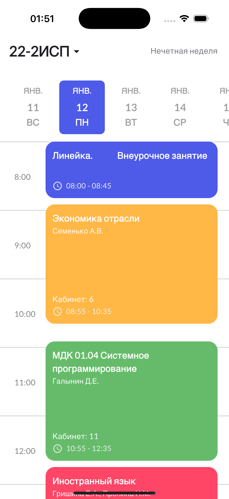
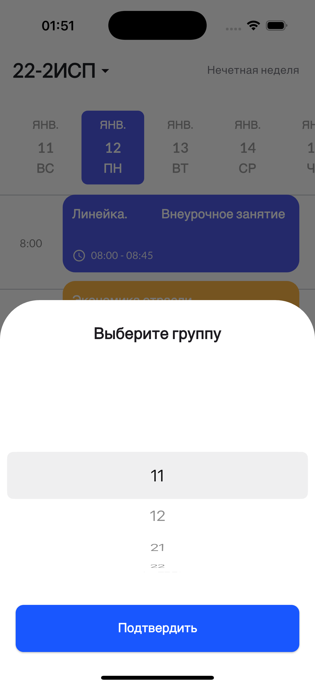

# Shedule

### 🕓 Открыть приложение (Веб версия)
[Открыть расписание](https://denup.github.io/shedule/)

## 📸 Скриншоты приложения

---

**Shedule** — это всегда актуальное расписание **под рукой**.  
Забудь про огромные PDF-файлы и бесконечные проверки:  
открыл приложение или сайт — и сразу видишь актуальную информацию.

📱 **Push-уведомления** сообщат об изменениях в расписании.  
🗂️ Даже без интернета — всё сохраняется в локальном хранилище,  
так что доступ к расписанию есть **где угодно и когда угодно**.

Больше не нужно каждый день открывать громоздкие файлы и “чекать” пары по пути на учёбу —  
**Shedule делает это за тебя.**
